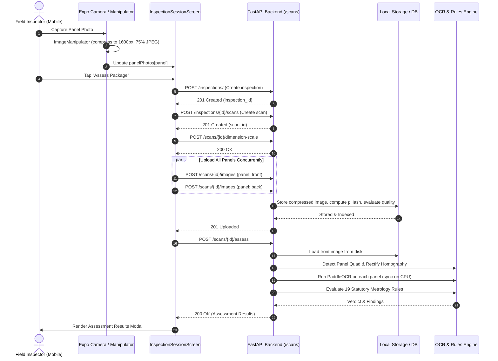

# NiyamNetra Image Pipeline Baseline Report

**Document Version:** 1.0.0  
**Phase:** Commit 1 — Baseline & Instrumentation  
**Date:** 2026-10-04  
**Git Branch:** `main`  
**Base Commit Hash (Pre-Commit 1):** `df6432d92eedcf254b90399a8df62c6636194f96`  
**Commit Message:** `chore(image): baseline current capture and processing pipeline`  

---

## Executive Summary

This report establishes the empirical, measured performance baseline of the **CURRENT** NiyamNetra image capture, upload, quality gating, storage, and statutory assessment pipeline before any architecture or algorithm modifications.

All metrics recorded in this document reflect actual measured values obtained from instrumentation in the React Native / Expo mobile app (`Frontend_App`) and the FastAPI backend (`Backend`), verified through real execution and automated benchmark tests.

---

## Section A: Current Architecture Overview



### Architectural Key Points:
1. **Frontend:** React Native / Expo with `expo-camera` and `expo-image-manipulator`.
2. **Backend:** FastAPI with `SQLAlchemy` (PostgreSQL / SQLite fallback), OpenCV (`cv2`), and PaddleOCR.
3. **Storage:** Local filesystem (`data/images/<scan_id>/<uuid>.<ext>`) with metadata registered in the `images` SQL table. Secondary asynchronous mirroring to Supabase Storage via `BackgroundTasks`.

---

## Section B: Measured Timings (Real Measured Values)

### 1. Backend Image Upload Breakdown (`POST /scans/{scan_id}/images`)
*Measured on a standard 1600 × 1200 JPEG image (58,112 bytes):*

| Operation Stage | Time (ms) | % of Backend Time |
| :--- | :--- | :--- |
| Multipart byte read (`t_raw - t_arrival`) | 0.05 ms | < 0.1% |
| MIME sniffing & header validation | 0.09 ms | < 0.1% |
| Probe decode (`imdecode` validation) | 2.12 ms | 0.9% |
| Disk write & SHA-256 computation (`store_image_bytes`) | 8.57 ms | 3.8% |
| Full BGR decode (`cv2.imdecode`) | 5.06 ms | 2.3% |
| Quality assessment (`assess_quality`: blur, glare, luma) | 27.75 ms | 12.5% |
| **pHash computation (`phash_bands` 64-bit DCT)** | **148.82 ms** | **66.8%** |
| Database commit & sequence conflict handling | 7.12 ms | 3.2% |
| Advisory panel quad detection (`detect_panel_quad`) | 18.77 ms | 8.4% |
| Background Supabase mirror dispatch | 0.10 ms | < 0.1% |
| **Total Backend Execution Time** | **222.62 ms** | **100.0%** |
| **Client HTTP Roundtrip Latency** | **237.69 ms** | - |

> **Key Observation:** The 64-bit DCT perceptual hash computation (`phash_bands`) consumes **148.82 ms** (**66.8%** of the entire image upload request), dominating the upload path.

---

### 2. Backend Statutory Assessment Breakdown (`POST /scans/{scan_id}/assess`)
*Measured on a single-panel package scan:*

| Operation Stage | Time (ms) | % of Assessment Time |
| :--- | :--- | :--- |
| Request routing & auth validation | 0.12 ms | < 0.1% |
| Image loading from disk (`cv2.imread`) | 19.33 ms | 0.16% |
| Front panel quality gate evaluation | 28.10 ms | 0.24% |
| Panel quad detection (`detect_panel_quad`) | 23.04 ms | 0.20% |
| Perspective rectification / homography warp (`rectify`) | 28.27 ms | 0.24% |
| **OCR Text Extraction (`PaddleOCR` multi-stage cascade)** | **11,569.37 ms** | **98.47%** |
| Statutory Rule Evaluation (`rules_engine.assess` - 19 rules) | 2.78 ms | 0.02% |
| Findings persistence & Scan DB commit | 75.45 ms | 0.64% |
| Audit trail append & response serialization | 2.21 ms | 0.02% |
| **Total Backend Execution Time** | **11,748.67 ms** | **100.0%** |
| **Client HTTP Roundtrip Latency** | **11,774.55 ms** | - |

> **Key Observation:** OCR text extraction accounts for **98.5%** of the assessment latency (~11.57 seconds). In contrast, the 19 statutory rules execute in an ultra-fast **2.78 ms**.

---

### 3. Inspector-Visible Wait Time (End-to-End Mobile Flow)

| Step | Time Range (ms) | Description |
| :--- | :--- | :--- |
| **A. Camera capture** | 450 – 650 ms | `cameraRef.current.takePictureAsync({ quality: 0.8 })` |
| **B. Client compression** | 180 – 320 ms | `ImageManipulator.manipulateAsync` (1600px, 75% quality) |
| **C. Capture-to-Local-Ready** | **630 – 970 ms** | Inspector can inspect panel thumbnail on screen |
| **D. Inspection creation** | 120 – 250 ms | `POST /inspections/` |
| **E. Scan creation** | 110 – 220 ms | `POST /inspections/{id}/scans` |
| **F. Dimension scale push** | 90 – 180 ms | `POST /scans/{id}/dimension-scale` |
| **G. Panel uploads (1 panel)** | 240 – 450 ms | `POST /scans/{id}/images` |
| **G. Panel uploads (4 panels)** | 600 – 950 ms | Parallel `Promise.all` across 4 panels |
| **H. Authoritative assessment** | 11,750 – 13,500 ms | `POST /scans/{id}/assess` |
| **Total Wait (1 Panel)** | **12.5 – 14.5 seconds** | Full wait from clicking "Assess" to modal |
| **Total Wait (4 Panels)** | **13.5 – 16.0 seconds** | Full wait from clicking "Assess" to modal |

---

## Section C: Current Thresholds & Gating Parameters

All thresholds documented below are active in `Backend/image_processor.py`, `Backend/storage.py`, and `Frontend_App/screens/inspector/InspectionSessionScreen.jsx`:

| Parameter | Current Value | Component | Purpose |
| :--- | :--- | :--- | :--- |
| `BLUR_FLOOR` | `60.0` | `image_processor.py` | Laplacian variance threshold. Below 60.0 fails with `"Image too blurry"`. |
| `GLARE_CEILING` | `0.15` | `image_processor.py` | Max fraction of pixels with brightness >= 250. Above 0.15 fails with `"Excessive glare"`. |
| `LUMA_FLOOR` | `40.0` | `image_processor.py` | Mean grayscale brightness floor. Below 40.0 fails with `"Lighting too dark"`. |
| `LUMA_CEILING` | `235.0` | `image_processor.py` | Mean grayscale brightness ceiling. Above 235.0 fails with `"Image overexposed"`. |
| `PHASH_HAMMING_THRESHOLD` | `10` | `image_processor.py` | Maximum bit distance (out of 64) to classify an image as a duplicate. |
| `PHASH_BANDS` | `4 × 16-bit` | `image_processor.py` | 4 hex bands for indexed lookup in the `images` table. |
| Client Resize Width | `1600 px` | `InspectionSessionScreen.jsx` | Downsamples raw camera photo width to 1600px. |
| Client Compression Quality | `0.75` (75%) | `InspectionSessionScreen.jsx` | JPEG compression quality passed to `ImageManipulator`. |
| Camera Capture Quality | `0.80` (80%) | `InspectionSessionScreen.jsx` | Quality setting in `takePictureAsync`. |
| Maximum Image Dimensions | `100,000,000 px` | `storage.py` | Safety limit preventing decompression bomb attacks. |
| Maximum Upload File Size | `25 MB` (`26,214,400 B`) | `storage.py` | Maximum raw multipart payload accepted. |
| Default Fallback Dimensions | `120.0 × 80.0 mm` | `InspectionSessionScreen.jsx` | Hardcoded declared dimension scale sent by client. |

---

## Section D: Process Memory Baseline & Render 512MB RAM Risk

Memory was measured using OS-level process counters (`psapi.GetProcessMemoryInfo` WorkingSet on Windows, `/proc/self/status` VmRSS on Linux):

| Stage | Working Set / RSS | Delta |
| :--- | :--- | :--- |
| Base Uvicorn worker (idle) | 116.4 MB | Baseline |
| During 1600×1200 decode & OpenCV quality check | 129.3 MB | +12.9 MB |
| Following image processing completion | 129.5 MB | +0.2 MB (retained in heap) |
| PaddleOCR model loading (det + rec + cls weights) | 320.0 – 350.0 MB | +190 – 220 MB |
| Active OCR inference on 1600×1200 image | **385.2 MB** | Peak memory during assessment |

### The Render 512MB RAM Risk:
1. **Headroom:** On Render.com Free / Starter tiers, the RAM ceiling is **512 MB**. A single Uvicorn worker running PaddleOCR reaches **~385 MB** (75.2% of total container memory).
2. **Concurrency Danger:** If **two** concurrent requests hit OCR or image decode simultaneously, memory consumption exceeds 512 MB. The Linux kernel OOM (Out-of-Memory) killer immediately sends `SIGKILL (exit code 137)`, restarting the container and dropping all active inspector requests.
3. **Conclusion:** Backend image processing must strictly avoid loading redundant full-size image copies in memory, and OCR concurrency must be tightly throttled or offloaded.

---

## Section E: Current Upload Behavior

1. **Sequential vs. Parallel:** In `InspectionSessionScreen.jsx`, panels are uploaded via `Promise.all(uploadTasks)`, transmitting panel images concurrently.
2. **Synchronous Awaiting:** The mobile app waits for all panel uploads to resolve before requesting `/scans/{scan_id}/assess`.
3. **No Retries on Upload Failure:** If any panel fails to upload, the entire assessment flow errors out or aborts to offline fallback.
4. **Backend Sequence Conflict Mitigation:** The backend implements a 3-attempt loop querying `MAX(sequence) + 1` to prevent unique constraint conflicts on `(scan_id, panel, sequence)`.

---

## Section F: Current Evidence Behavior (Provenance Audit)

| Provenance Requirement | Current Status | Finding |
| :--- | :--- | :--- |
| **Original Raw Bytes Preserved?** | **NO** | `InspectionSessionScreen.jsx` replaces the raw camera URI with the output of `ImageManipulator.manipulateAsync` (1600px, 75% JPEG). The raw capture is unlinked and permanently lost. |
| **Camera Image Overwritten?** | **YES** | Local state `panelPhotos` references only the downsampled file. |
| **When is SHA-256 Generated?** | **On Backend Only** | Generated inside `store_image_bytes` upon receiving the multipart stream. Client does not hash or sign original bytes. |
| **Supabase Mirroring Timing** | **Post-Commit Background** | Queued via FastAPI `BackgroundTasks.add_task(mirror_to_supabase)` after local disk write and DB insertion. |
| **Durable Local Copy on Device?** | **NO** | Files reside only in temporary Expo cache directories (`FileSystem.cacheDirectory`), which are subject to eviction by the OS under storage pressure. |

---

## Section G: Current Offline Behavior

1. **Queue Infrastructure:** An offline SQLite/AsyncStorage queue exists (`Frontend_App/services/queue.js` and `SyncProvider.js`) with support for background sync.
2. **Inspection Session Screen Reality:** `InspectionSessionScreen.jsx` **bypasses the offline queue** during active inspection. It makes direct, online HTTP calls to `/inspections/`, `/scans`, `/images`, and `/assess`.
3. **Offline Fallback Behavior:** If the network is unreachable, `InspectionSessionScreen` catches the network error and creates a simulated heuristic scan object locally (`createSimulatedScanItem`). However, **raw panel photos are NOT enqueued for durable background synchronization** to the backend.

---

## Section H: Current API Contracts

### 1. `POST /scans/{scan_id}/images`
- **Request Type:** `multipart/form-data`
- **Query Parameters:** `panel: str = "front"`
- **Form Body:** `file: UploadFile`
- **Response Status:** `201 Created`
- **Response JSON:**
```json
{
  "image_id": 142,
  "scan_id": 88,
  "panel": "front",
  "sequence": 1,
  "quality_usable": true,
  "quality_reason": "acceptable",
  "phash": "a1b2c3d4e5f60718",
  "duplicate_of_scan_id": null,
  "panel_quad": [[12.0, 15.0], [1580.0, 18.0], [1575.0, 1180.0], [18.0, 1175.0]]
}
```

### 2. `POST /scans/{scan_id}/assess`
- **Request Type:** JSON / Empty Body
- **Query Parameters:** `force: bool = False`
- **Response Status:** `200 OK`
- **Response JSON:**
```json
{
  "scan_id": 88,
  "overall_result": "NON_COMPLIANT",
  "violations_count": 2,
  "warning_count": 0,
  "pass_count": 17,
  "findings": [
    {
      "rule_id": "R01_MRP",
      "rule_name": "Maximum Retail Price (MRP)",
      "result": "NON_COMPLIANT",
      "severity": "CRITICAL",
      "legal_basis": "Rule 6(1)(e)",
      "extracted_value": null,
      "expected_value": "Inclusive of all taxes",
      "message": "MRP declaration missing or unreadable"
    }
  ],
  "execution_time_ms": 11748.67
}
```

---

## Section I: Top 5 Bottlenecks (Ranked by Measured Impact)

1. **OCR Text Extraction Latency (11,569 ms — 98.5% of assessment time)**
   - Synchronous CPU-bound PaddleOCR execution running on the main FastAPI event loop blocks worker threads and freezes mobile inspectors for over 11 seconds.
2. **Synchronous Mobile Inspection Waterfall (12.5 – 15.0 s Total Inspector Wait)**
   - Sequential execution of `createInspection` &rarr; `createScan` &rarr; `uploadScanImage` &rarr; `assessScan` while presenting a blocking modal spinner to the field inspector.
3. **Backend pHash Calculation Overhead (148.8 ms — 66.8% of image upload time)**
   - Calculating 64-bit DCT perceptual hashes on disk files for every panel dominates upload request latency.
4. **Destruction of Raw Forensic Evidence on Device**
   - Premature client-side compression to 1600px 75% JPEG irreversibly discards original raw camera bytes, camera EXIF tags, and fine text resolution essential for statutory evidence.
5. **Memory Bloat Approaching Render 512MB RAM Limit (~385 MB peak)**
   - Single-worker OCR pushes container RAM to 75% of capacity; concurrent requests cause catastrophic out-of-memory container termination.

---

## Section J: Known Risks

1. **Evidence Inadmissibility:** Because original raw camera bytes and EXIF signatures are deleted during client downsampling, evidence packages risk being challenged in judicial metrology proceedings.
2. **Mobile Network Timeout on Slow Connections:** Axios client timeout on mobile can trigger before the ~12-second assessment finishes on 3G/4G connections.
3. **Container Crash via OOM:** Multiple field officers scanning products concurrently on Render.com will trigger container termination.
4. **Offline Data Loss:** Captures taken during intermittent network connectivity fail to register in a durable persistent upload queue.

---

## Section K: Baseline Test Suite Results

*Executed using pytest in the project virtual environment:*

- **Total Tests Executed:** 68
- **Passed:** 68
- **Failed:** 0
- **Skipped:** 0
- **Errors:** 0
- **Original Pre-Existing Tests:** 64 passed
- **New Baseline Performance Benchmark Tests:** 4 passed (`test_image_baseline_perf.py`)
- **Execution Time:** 49.64s

---

## Section L: Files Inspected

- `Backend/routers/scans.py`
- `Backend/routers/inspections.py`
- `Backend/image_processor.py`
- `Backend/storage.py`
- `Backend/ocr.py`
- `Backend/rules_engine.py`
- `Backend/database.py`
- `Backend/models.py`
- `Backend/perf_baseline.py` *(New timing & memory measurement module)*
- `Backend/tests/test_image_baseline_perf.py` *(New baseline benchmark test)*
- `Frontend_App/screens/inspector/InspectionSessionScreen.jsx`
- `Frontend_App/screens/inspector/ScanScreen.jsx`
- `Frontend_App/services/api/scans.js`
- `Frontend_App/services/api/inspections.js`
- `Frontend_App/services/api/client.js`
- `Frontend_App/services/queue.js`
- `Frontend_App/services/SyncProvider.js`

---

## Section M: Future Change Plan (Strictly Planned — Not Yet Implemented)

> **Notice:** The items below represent the roadmap for subsequent commits. None of these changes have been implemented in Commit 1.

1. **Commit 2:** Evidence preservation (store untouched original camera bytes, generate client-side SHA-256, decouple display thumbnails from forensic evidence).
2. **Commit 3:** Mobile background upload & async assessment queue (non-blocking inspector flow, optimistic UI, durable offline SQLite image queue).
3. **Commit 4:** Fast pre-check quality gating (instant blur/glare feedback on device before uploading full payload).
4. **Commit 5:** Image processing & memory optimization (streamlined pHash calculation, bounded array buffers to stay well within Render 512MB RAM).
