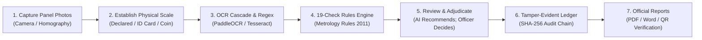
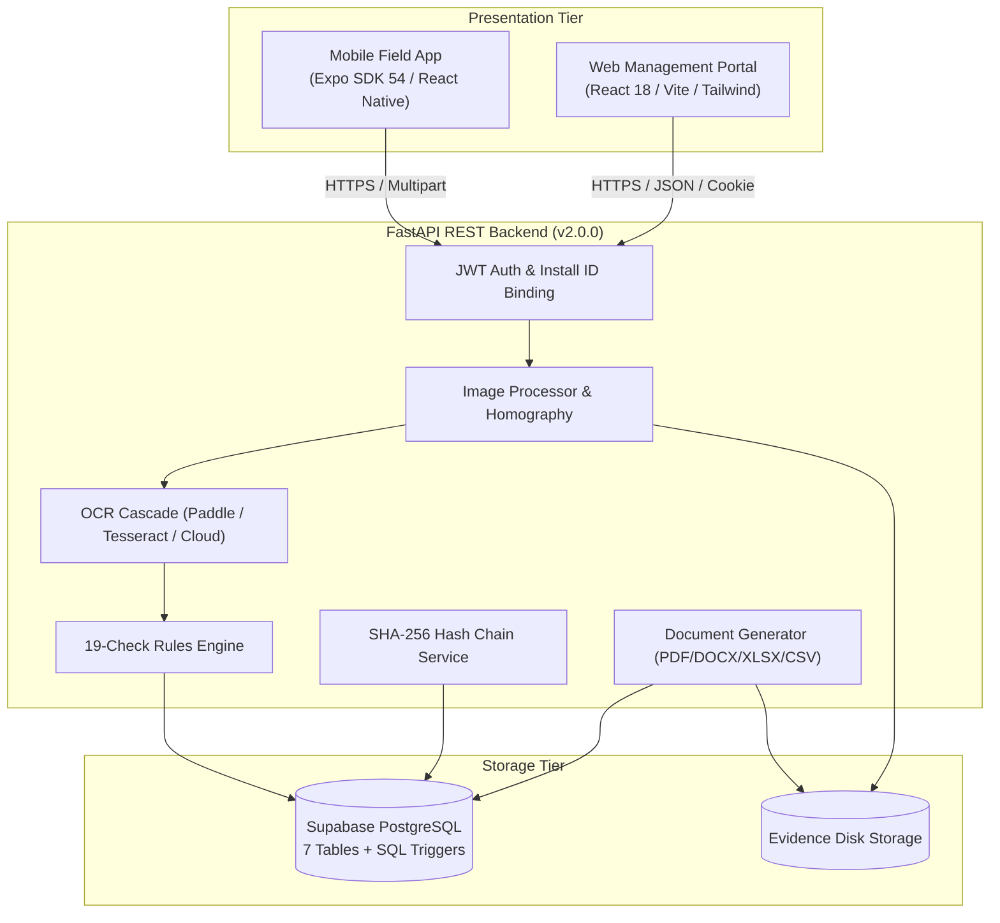
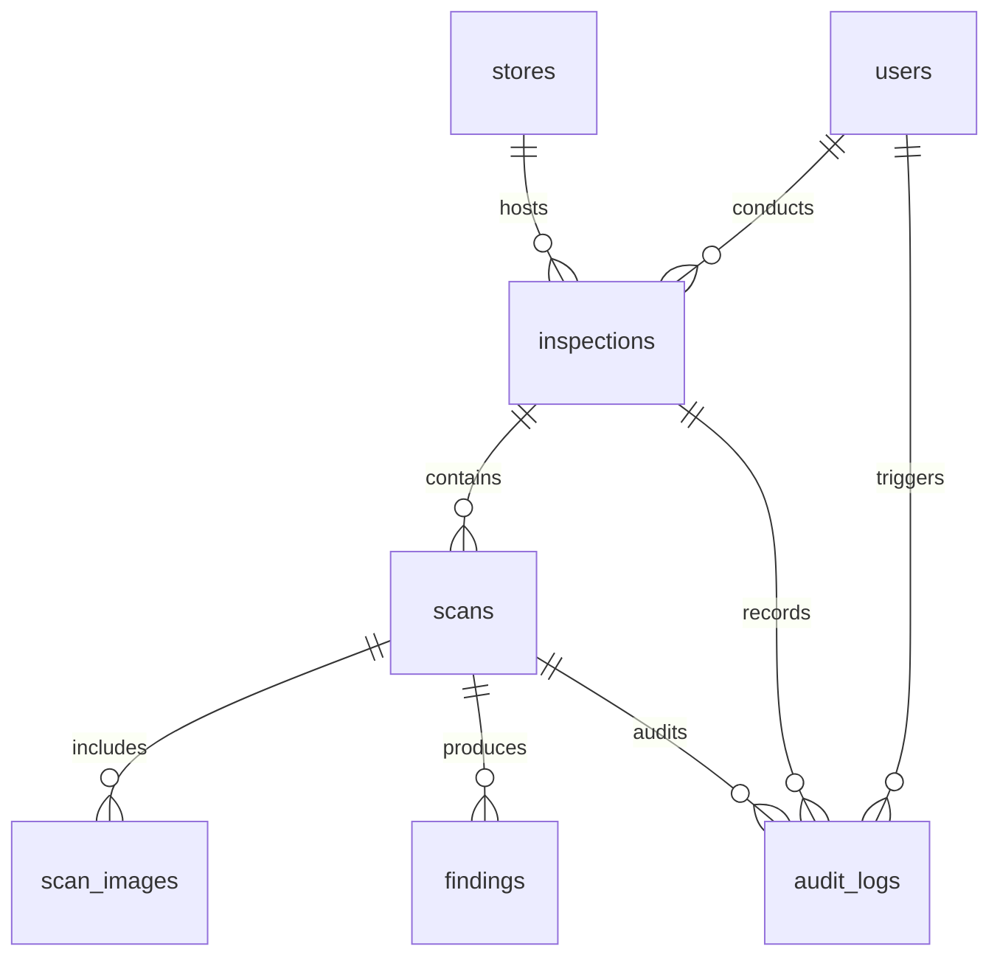

# NiyamNetra – Legal Metrology Rules System

**Automated packaged-commodity compliance scanner for the Legal Metrology (Packaged Commodities) Rules, 2011.**  
*Smart India Hackathon 2026 · Problem Statement SIH26034 · Ministry of Consumer Affairs, Food & Public Distribution*

[](https://fastapi.tiangolo.com)
[](https://python.org)
[](https://supabase.com)
[](https://vitejs.dev)
[](https://expo.dev)
[)-blue)](https://consumeraffairs.gov.in)

> NiyamNetra audits packaged commodity labels against Indian metrology law in seconds. It replaces manual calipers and paper checklists with automated declaration detection, optical character height verification, tamper-evident audit ledgers, and court-admissible PDF/Word/Excel inspection dockets.

---

## Table of Contents

- [Overview](#overview)
- [Quick Start](#quick-start)
- [Project at a Glance](#project-at-a-glance)
- [How NiyamNetra Works](#how-niyamnetra-works)
- [User Roles & Workflows](#user-roles--workflows)
- [Key Features](#key-features)
- [Technology Stack](#technology-stack)
- [System Architecture](#system-architecture)
- [Project Structure](#project-structure)
- [Rules Engine & Statutory Checks](#rules-engine--statutory-checks)
- [Database & Migrations](#database--migrations)
- [API Reference](#api-reference)
- [Authentication & Security](#authentication--security)
- [Testing & Quality Assurance](#testing--quality-assurance)
- [Deployment Guide](#deployment-guide)
- [Known Limitations & Discrepancies](#known-limitations--discrepancies)
- [Future Roadmap](#future-roadmap)

---

## Overview

### What is NiyamNetra?
NiyamNetra is a full-stack compliance enforcement platform built for the **Department of Consumer Affairs (Ministry of Consumer Affairs, Food & Public Distribution)**. It enables field enforcement officers and central administrators to audit packaged goods against the **Legal Metrology (Packaged Commodities) Rules, 2011** (amended up to 2026, incorporating GSR 128(E) and the Jan Vishwas Act).

### The Real-World Problem
Every pre-packaged item sold in India must display mandatory declarations: manufacturer/packer address, generic commodity name, net quantity, MRP inclusive of all taxes, packing date, consumer care info, and country of origin. Manual inspection is slow, subjective, and prone to legal challenges regarding evidence authenticity and measurement error.

### What Makes NiyamNetra Different?
- **Honest Denominators:** Never masks unreadable labels as compliant. Reports exact assessed ratios (e.g., `16 of 18 checks assessed`).
- **Legal Forensics:** Uses physical scale calibration (ID card / coin) with measurement uncertainty, write-once database triggers, and a SHA-256 cryptographic audit chain.
- **The AI Recommends; The Officer Decides:** Machine assessment guides the inspector, but human overrides are recorded alongside the AI finding, never replacing it.

---

## Quick Start

Get the entire system running locally in three terminals.

### Prerequisites

- **Python:** Version 3.11+
- **Node.js:** Version 18+ or 20+ and `npm`
- **PostgreSQL / Supabase:** A PostgreSQL connection URI (`postgresql+psycopg://...`)
- **Tesseract OCR (Recommended):** Installed on your system (`tesseract-ocr` and `libzbar0` on Linux, UB-Mannheim installer on Windows)
- **Mobile Device:** Expo Go app installed on an Android or iOS device sharing the same Wi-Fi

---

### Step 1: Run the Backend

```bash
# 1. Navigate to Backend
cd Backend

# 2. Create and activate a Python virtual environment
python -m venv niyamnetra_venv
# Windows (PowerShell): .\niyamnetra_venv\Scripts\Activate.ps1
# Linux / macOS: source niyamnetra_venv/bin/activate

# 3. Install dependencies
pip install --upgrade pip
pip install -r requirements.txt

# 4. Configure environment
cp .env.example .env
# Edit .env and supply:
#   DATABASE_URL=postgresql+psycopg://...
#   JWT_SECRET=your_super_secret_key_minimum_32_characters

# 5. Apply migrations and seed demonstration data
alembic upgrade head
# PowerShell: $env:SEED_PASSWORD="ChangeMe@123456"; python seed.py
# Linux/macOS: SEED_PASSWORD="ChangeMe@123456" python seed.py

# 6. Start the API server (bind 0.0.0.0 so phones on LAN can reach it)
uvicorn main:app --host 0.0.0.0 --port 8000 --reload
```

> **Verification:** Open [http://localhost:8000/health](http://localhost:8000/health) — `checks_registered` must return `19`. Interactive Swagger API docs are live at [http://localhost:8000/docs](http://localhost:8000/docs).

---

### Step 2: Run the Web Portal

```bash
# 1. Navigate to Frontend_Portal
cd Frontend_Portal

# 2. Install dependencies
npm install

# 3. Start development server
npm run dev
```

> **Verification:** Open [http://localhost:5173](http://localhost:5173) and sign in:
> - **Admin:** `LM-ADM-001` / Password set during `seed.py`
> - **Inspector:** `LM-TG-1042` / Password set during `seed.py`

---

### Step 3: Run the Mobile App

```bash
# 1. Navigate to Frontend_App
cd Frontend_App

# 2. Install dependencies
npm install

# 3. Launch the Expo bundler
npx expo start
```

> **Testing on Device:** Open the **Expo Go** app on your phone (connected to the same Wi-Fi) and scan the QR code.  
> **Testing in Browser:** Press `w` in the terminal to launch the web client at [http://localhost:8081](http://localhost:8081).

---

### Minimum Environment Setup

Only two environment variables are required in `Backend/.env` to start:

| Variable | Required | Description | Example |
|---|---|---|---|
| `DATABASE_URL` | **Yes** | Supabase/PostgreSQL connection URI using `postgresql+psycopg://` | `postgresql+psycopg://postgres.<ref>:<pw>@aws-0-<region>.pooler.supabase.com:5432/postgres` |
| `JWT_SECRET` | **Yes** | Random string $\ge 32$ characters | `python -c "import secrets; print(secrets.token_hex(32))"` |

<details>
<summary>⚙️ View all optional backend environment variables</summary>

```bash
# Application Mode
ENV=dev                                   # dev | prod (prod enforces HSTS and Secure cookies)
APP_NAME=NiyamNetra
PUBLIC_BASE_URL=http://localhost:8000     # Base URL for verification QR codes

# Auth Tuning
JWT_ALGORITHM=HS256
ACCESS_TOKEN_HOURS=12
REFRESH_TOKEN_DAYS=30
REFRESH_COOKIE_NAME=nn_refresh
REFRESH_COOKIE_CROSS_SITE=false           # Set true if local portal talks to remote HTTPS backend

# OCR Options
OCR_LANGS=en,hi
OCR_MIN_CONFIDENCE=0.60
TESSERACT_CMD=C:\Program Files\Tesseract-OCR\tesseract.exe # Windows path if non-standard
OCR_SPACE_API_KEY=                        # Free cloud OCR fallback for slim deployments
OCR_SPACE_ENGINE=1
OCR_SPACE_LANGUAGE=eng

# Supabase Storage Mirror (Optional; local disk is authoritative)
SUPABASE_URL=
SUPABASE_SERVICE_KEY=
SUPABASE_BUCKET=NiyamNetra_Images

# System Ceilings
MAX_UPLOAD_MB=25
MAX_IMAGE_PIXELS=80000000                 # Decompression bomb prevention
MIN_PANEL_PIXEL_HEIGHT=400                # Minimum resolution for defensible scale
EVIDENCE_MIN_FREE_GB=5.0                  # Refuses new visits if disk falls below floor
```

</details>

---

## Project at a Glance

| Area | Component | Purpose |
|---|---|---|
| **Mobile App** | React Native / Expo SDK 54 | Live camera capture, on-device blur/glare checks, GPS geofencing, and offline inspection sync. |
| **Web Portal** | React 18 / Vite 5 / Tailwind CSS | State-wide analytics, inspection review queue, audit ledger exploration, and user management. |
| **Backend API** | FastAPI 0.110 / SQLAlchemy 2.0 | Async REST API, RBAC ownership guards, and SSRF-guarded e-commerce listing fetcher. |
| **Database** | Supabase PostgreSQL | 7 relational tables with SQL triggers enforcing append-only audit logs and immutable verdicts. |
| **OCR Cascade** | PaddleOCR $\rightarrow$ Tesseract $\rightarrow$ OCR.space | Multi-tier OCR pipeline for dual-language (English/Hindi) declaration reading and barcode scanning. |
| **Rules Engine** | Python 3.11 (`rules_engine.py`) | Deterministic execution of 19 metrology checks, honest denominator scoring, and penalty tiering. |
| **Reporting** | ReportLab, python-docx, openpyxl | Programmatic generation of statutory PDF, Word (.docx), Excel (.xlsx), and CSV inspection dockets. |

---

## How NiyamNetra Works



1. **Inspection Visit:** The inspector selects a store. The system verifies GPS coordinates against the store's registered geofence radius.
2. **Multi-Panel Capture:** Photos of product panels (front, back, MRP, batch) are captured with real-time blur, glare, and exposure checks.
3. **Fronto-Parallel Rectification:** 4-point homography rectifies angled perspective into an upright plane.
4. **Scale & Uncertainty:** Converts pixels to physical millimeters using declared height or reference objects, tracking measurement uncertainty ($\pm \text{mm}$).
5. **OCR Extraction:** Text lines, character heights, and barcodes are parsed; net quantity qualifiers are tested against `forbidden_words.json`.
6. **Rules Evaluation:** 19 statutory checks execute deterministically. Dependent checks halt if exempt under Rule 3 or Rule 26(a).
7. **Forensic Recording:** Actions append to the cryptographic SHA-256 audit chain. Non-violation photos are purged to preserve storage.
8. **Docket Issuance:** Multi-format inspection dockets are generated with embedded QR verification codes.

---

## User Roles & Workflows

| Role | Primary Interface | Core Responsibilities |
|---|---|---|
| **Legal Metrology Inspector (`inspector`)** | **Frontend_App** (Mobile) & **Frontend_Portal** (Inspector Views) | • Conducts on-site retail inspections within geofenced radius.<br/>• Captures package photos and records declared dimensions.<br/>• Reviews AI findings, applies overrides with legal reasons, and signs visits.<br/>• Generates daily summary and store-level inspection dockets. |
| **Enforcement Administrator (`admin`)** | **Frontend_Portal** (Web Dashboard) & **Frontend_App** (Monitoring) | • Monitors state-wide compliance trends and top violated checks.<br/>• Adjudicates items in the human review queue.<br/>• Verifies cryptographic audit chain integrity against tampering.<br/>• Manages store registries, inspector accounts, and hardware device bindings (`install_id`). |

---

## Key Features

### Compliance & Legal Metrology
- **19 Statutory Checks:** Implements Chapter II scope, small package exemptions, mandatory declarations, MRP inclusive wording, standard pack sizes, character height/width, clear margins, and e-commerce listings.
- **Forbidden Qualifiers Filter:** Disallows hedging terms (*approx*, *minimum*, *when packed*, *average*) using word-boundary regexes.
- **Section 36 Sanction Tiers:** Maps offenses to Section 36(1) (declarations/formatting) or Section 36(2) (short quantity/overpricing) with graduated enforcement suggestions.

### Computer Vision & OCR
- **Multi-Stage Cascade:** On-device PaddleOCR 2.8 (primary) $\rightarrow$ local Tesseract 5 (fallback) $\rightarrow$ OCR.space API (cloud fallback) $\rightarrow$ fail-open.
- **Physical Scale Calibration:** Derives mm-per-pixel scale from declared height, an ID card (85.60 mm), or a ₹5 coin (23.0 mm) with error bounds.
- **Banded Perceptual Hashing:** 64-bit pHash indexed across eight 8-bit columns (`phash_b0`..`b7`) for fast Hamming duplicate detection ($\le 5$).
- **Perspective Homography:** Corrects perspective distortion on angled captures via OpenCV 4-point homography.

### Forensics & Evidence Integrity
- **Byte-for-Byte Storage:** Writes image files to disk *before* computing SHA-256; digests describe the exact file on disk.
- **Immutable Verdicts:** PostgreSQL triggers prevent altering `engine_verdict`. Human overrides are recorded in `human_verdict` with mandatory reasons.
- **Append-Only Audit Ledger:** Cryptographic hash-chained audit log (`AuditLog`) where each entry hashes its predecessor's digest.
- **Storage Minimization:** Photos of compliant packages are automatically deleted post-assessment; files are retained solely for violations.

### Mobile Field Operations & Reporting
- **Field-Ready Mobile App:** Built on Expo SDK 54 with camera controls, geofencing, and offline inspection queuing.
- **Screen Capture Protection:** Native prevention of screenshots and screen recording on evidence screens (`expo-screen-capture`).
- **Multi-Format Reports:** Generates statutory PDF, Word (DOCX), Excel (XLSX), and CSV dockets with embedded verification QR codes.

---

## Technology Stack

| Layer | Primary Technology | Purpose |
|---|---|---|
| **Mobile Client** | React Native (Expo SDK 54) | Field inspector application for live photo capture and offline queueing |
| **Web Portal** | React 18 / Vite 5 / Tailwind CSS | Responsive administrative dashboard, review queue, and PWA portal |
| **Backend API** | FastAPI 0.110 / Uvicorn | Asynchronous Python REST API with dependency-injected RBAC |
| **Database** | PostgreSQL (Supabase) / SQLAlchemy 2.0 | Relational database with SQL check constraints, triggers, and Alembic migrations |
| **Computer Vision** | OpenCV 4.9 / NumPy / Pillow | Image rectification, CLAHE enhancement, blur/glare grading, scale derivation |
| **OCR Cascade** | PaddleOCR 2.8 / PyTesseract / OCR.space | Dual-language (English/Hindi) declaration reading and barcode scanning |
| **Rules Engine** | Python 3.11 (`rules_engine.py`) | Pure deterministic metrology evaluation, denominator scoring, sanction mapping |
| **Reporting** | ReportLab / python-docx / openpyxl | Programmatic PDF, Word, Excel, and CSV statutory document export |

<details>
<summary>📦 View complete verified dependencies and versions</summary>

### Backend Dependencies (`Backend/requirements.txt`)
- `fastapi==0.110.0`
- `uvicorn[standard]==0.29.0`
- `pydantic==2.6.4` & `pydantic-settings==2.2.1`
- `SQLAlchemy==2.0.29` & `alembic==1.13.1`
- `psycopg[binary]==3.1.18` (psycopg 3 driver)
- `PyJWT==2.8.0`, `passlib==1.7.4`, `bcrypt==4.0.1`
- `numpy==1.26.4`, `opencv-python-headless==4.9.0.80`
- `paddlepaddle==2.6.2`, `paddleocr==2.8.0`
- `pytesseract==0.3.10`, `Pillow==10.3.0`, `imagehash==4.3.1`, `pyzbar==0.1.9`
- `reportlab==4.1.0`, `python-docx==1.1.0`, `openpyxl==3.1.2`, `qrcode[pil]==7.4.2`
- `python-dotenv==1.0.1`, `cachetools==5.3.3`, `httpx==0.27.0`

### Frontend Web Portal (`Frontend_Portal/package.json`)
- `react==^18.2.0` & `react-dom==^18.2.0`
- `vite==^5.2.0` & `@vitejs/plugin-react==^4.2.1`
- `tailwindcss==^3.4.3`, `postcss==^8.4.38`, `autoprefixer==^10.4.19`
- `react-router-dom==^6.23.0`, `recharts==^2.12.7`, `lucide-react==^0.383.0`
- `axios==^1.6.8`, `idb==^8.0.0`, `date-fns==^3.6.0`, `vite-plugin-pwa==^0.20.0`

### Frontend Mobile App (`Frontend_App/package.json`)
- `expo==^54.0.37` & `react-native==0.81.5` (`react==19.1.0`)
- `expo-camera==~17.0.10`, `expo-location==~19.0.8`
- `expo-secure-store==~15.0.8`, `expo-file-system==~19.0.24`
- `expo-local-authentication==~17.0.9`, `expo-screen-capture==~8.0.10`
- `@react-navigation/native==^6.1.9`, `@react-navigation/bottom-tabs==^6.5.0`, `@react-navigation/native-stack==^6.9.0`

</details>

---

## System Architecture

### High-Level Architecture



### Component Responsibilities

- **FastAPI Backend:** Handles routing, authentication, CORS regex evaluation, security headers, and SSRF-guarded e-commerce listing fetching.
- **Image Processor:** Validates blur/glare thresholds, performs perspective rectification, derives physical scale, and computes banded perceptual hashes.
- **Rules Engine:** Evaluates pure dataclass contexts (`CheckContext`) against 19 compliance checks, decoupled from database I/O for deterministic testing.
- **Audit Service:** Maintains append-only audit records with canonical JSON serialization and predecessor hash linking.
- **PostgreSQL Database:** Enforces schema invariants via check constraints and database triggers.

<details>
<summary>🔍 Detailed Architecture & Forensic Pipeline</summary>

### 1. Evidence Ingestion & Forensic Hashing
- Uploaded image bytes are verified with Pillow (`Image.MAX_IMAGE_PIXELS = 80_000_000`) to block decompression bombs.
- Files are written directly to `Backend/evidence/{inspection_id}/{scan_id}/{uuid}.ext`.
- SHA-256 is computed over the stored bytes on disk, guaranteeing court reproducibility.
- An optional mirror upload is dispatched to Supabase Storage (`NiyamNetra_Images` bucket).

### 2. Optical Scale Derivation
- `compute_scale()` calculates $\text{mm/pixel}$ using:
  - *ID-1 Reference Card:* $85.60\text{ mm} / \text{pixel\_size}$ ($\pm 2\%$ uncertainty)
  - *₹5 Coin:* $23.0\text{ mm} / \text{pixel\_size}$ ($\pm 5\%$ uncertainty)
  - *Declared Panel Height:* $\text{height\_mm} / \text{pixel\_height}$ (with $\pm 1\text{ mm}$ operator ruler error)
- If the shortfall between measured height and the statutory threshold is smaller than the calculated uncertainty, the engine records `not_assessed` rather than a false breach.

### 3. Banded Perceptual Hashing (pHash)
- 64-bit pHash is split into eight 8-bit bands (`phash_b0` through `phash_b7`), each indexed in PostgreSQL.
- Under the pigeonhole principle, two images within Hamming distance $d \le 7$ must share at least $8 - d \ge 1$ identical 8-bit bands.
- Candidate lookups use indexed SQL `OR` queries across bands, avoiding $O(n)$ full-table scans.

### 4. SSRF-Guarded E-Commerce Fetcher (`listing_fetcher.py`)
- For Rule 6(1A) checks (`CHK15` and `CHK16`), URLs are validated to disallow non-HTTPS schemes.
- Hostnames are resolved and checked against blocked subnets (RFC 1918, link-local `169.254.0.0/16`, loopback, carrier-grade NAT).
- HTTP redirects are disabled (`follow_redirects=False`) to prevent 302 redirects to cloud metadata endpoints.

</details>

---

## Project Structure

```text
NiyamNetra/
├── render.yaml                   # Render Blueprint for automated cloud deployment
├── Backend/                      # FastAPI Python Application
│   ├── alembic/                  # Alembic migrations (0001_initial_schema.py)
│   ├── rules/                    # Rules catalog & forbidden words dictionary
│   ├── routers/                  # API endpoints (auth, inspections, scans, reports, admin)
│   ├── tests/                    # Pytest dual-engine test setup (conftest.py)
│   ├── audit.py                  # Cryptographic SHA-256 audit ledger
│   ├── config.py                 # Pydantic Settings with strict validation
│   ├── Dockerfile                # Production containerfile with Tesseract & libzbar
│   ├── image_processor.py        # Homography, scale calibration, banded pHash
│   ├── main.py                   # FastAPI entrypoint, middleware, and health check
│   ├── models.py                 # 7 SQLAlchemy ORM models with CHECK constraints
│   ├── ocr_engine.py             # PaddleOCR + Tesseract + OCR.space cascade
│   ├── report_generator.py       # Statutory PDF, DOCX, XLSX, and CSV generator
│   ├── requirements.txt          # Complete local Python dependencies
│   ├── rules_engine.py           # 19 deterministic compliance checks
│   └── seed.py                   # Idempotent demo database fixture
├── Frontend_App/                 # React Native / Expo Mobile Application
│   ├── api/                      # Dynamic backend URL resolution & Axios client
│   ├── auth/                     # AuthContext with SecureStore token storage
│   ├── navigation/               # Native bottom-tabs and stack navigators
│   ├── offline/                  # Offline inspection queue & background sync
│   ├── screens/                  # Mobile screens (inspector & admin flows)
│   └── app.json                  # Expo SDK 54 manifest & permissions
├── Frontend_Portal/              # React + Vite Web Management Portal (PWA)
│   ├── src/
│   │   ├── api/                  # Axios HTTP client with auto-refresh interceptor
│   │   ├── auth/                 # Role-based protected routes (AdminRoute, ProtectedRoute)
│   │   ├── screens/              # 19 Portal screens (AdminDashboard, ReviewQueue, etc.)
│   │   ├── shell/                # Navigation rail, top bar, and layout shell
│   │   └── ui/                   # Modular design system components
│   ├── scripts/                  # Contrast testing and route audit validation scripts
│   └── vite.config.js            # Vite build configuration with PWA integration
└── Docs/                         # Engineering, architecture, and legal metrology docs
```

---

## Rules Engine & Statutory Checks

### The 19 Compliance Checks

| Check ID | Function Name | Statutory Basis | Summary of Evaluation Logic |
|---|---|---|---|
| `CHK03` | `chk03_chapter_ii_applicability` | Rule 3 | Verifies retail sale. Halts as `out_of_scope` if wholesale, institutional, or $>25\text{ kg/L}$ ($>50\text{ kg}$ agri). |
| `CHK02` | `chk02_small_package_exemption` | Rule 26(a) | Evaluates exemption for packages $\le 10\text{ g/ml}$. Tobacco products are strictly excluded. |
| `CHK14` | `chk14_medical_device_routing` | Medical Devices Rules | Routes medical devices to specialized rules; marks non-applicable metrology checks as exempt. |
| `CHK01` | `chk01_declarations_present` | Rule 6(1) | Audits mandatory presence of manufacturer, packer, commodity, net qty, date, MRP, and consumer care. |
| `CHK04` | `chk04_mrp_form` | Rule 6(1)(e) | Checks MRP format (`Maximum Retail Price Rs./₹ ... incl. of all taxes`). |
| `CHK05` | `chk05_net_quantity_expression` | Rule 6(1)(c), Rules 12–13 | Verifies standard metric units and flags prohibited qualifiers (*approx*, *when packed*, etc.). |
| `CHK11` | `chk11_sticker` | Rule 6(6) | Permitted only for price reduction; stickers increasing price or obscuring original MRP are breaches. |
| `CHK12` | `chk12_country_of_origin` | Rule 6(10) | Validates country of origin declaration on imported goods. |
| `CHK13` | `chk13_best_before` | Rule 6(1)(d) | Audits expiry or best-before date declarations on perishable commodities. |
| `CHK10` | `chk10_prescribed_quantity` | Rule 5, Second Schedule | Checks adherence to standard pack sizes. *(Returns `not_assessed` while schedule table is unpopulated).* |
| `CHK17` | `chk17_fssai_advisory` | FSSAI Regulations | Advisory check verifying presence of the 14-digit FSSAI license number on food packages. |
| `CHK06` | `chk06_character_height` | Rule 7, Table-I | Compares character height against PDP area minimums (normal vs blown/moulded). |
| `CHK06b`| `chk06b_net_quantity_height` | Rule 7, Table-I | Specific character height check tailored to the net quantity numeral. |
| `CHK07` | `chk07_character_width` | Rule 7 | Verifies letter width-to-height ratio (excluding letter 'I' and numeral '1'). |
| `CHK09` | `chk09_clear_space` | Rule 9 | Checks clear surrounding border margin around mandatory declaration text blocks. |
| `CHK08` | `chk08_contrast` | Rule 9 | Checks contrast ratio between text lettering and background packaging panel. |
| `CHK15` | `chk15_ecommerce_listing` | Rule 6(1A) | Validates mandatory declarations on e-commerce marketplace product listings. |
| `CHK16` | `chk16_platform_origin_filter`| Rule 6(10) | Audits whether e-commerce platforms provide country-of-origin filtering tools. |
| `CHK18` | `chk18_violation_tier` | Section 36, LM Act | Derived classification mapping failures to Section 36(1), Section 36(2), or both limbs. |

### Assessment Outcomes

- **Check Verdicts:** `pass` | `fail` | `not_assessed` (mandatory reason)
- **Scan Outcomes:**
  - `compliant`: All applicable checks assessed and passed.
  - `violation`: One or more assessable checks failed.
  - `not_assessed`: Checks could not be completed; physical verification or recapture required.
  - `out_of_scope`: Package is legally exempt under Rule 3 or Rule 26(a).

### Graduated Enforcement Sanctions

`rules_engine._graduated_action()` recommends statutory actions:
- **`prosecution_36_2`:** Short net quantity or deceptive pricing directly impacting consumers.
- **`prosecution_36_1`:** Critical declaration omissions or $\ge 3$ major non-compliances.
- **`improvement_notice_s15`:** Minor/advisory formatting defects under Section 15.
- **`recapture_required` / `human_review`:** Triggered when image defects prevent automated verdict.

---

## Database & Migrations

The database consists of **7 relational tables** running on PostgreSQL via Supabase:



1. **`users`:** Inspectors and admins (`employee_id`, role, `install_id`, `token_epoch`).
2. **`stores`:** Retail/wholesale establishments (`name`, location coordinates, `geofence_radius_m`).
3. **`inspections`:** Field visits (`status`, `geofence_status`, `signature_status`, `clock_skew_seconds`).
4. **`scans`:** Package assessments (`overall_result`, `violation_limb`, `checks_total`, `checks_assessed`).
5. **`scan_images`:** Multi-panel photos (`sha256`, `phash`, indexed bands `phash_b0`..`b7`, quality metrics).
6. **`findings`:** Results for each check (`engine_verdict`, `human_verdict`, `override_reason`, `severity`).
7. **`audit_logs`:** Tamper-evident ledger (`seq`, `action`, `old_value`, `new_value`, `hash_prev`, `hash_self`).

### SQL Triggers for Immutability

Defined in `alembic/versions/0001_initial_schema.py`:
- `audit_no_update` & `audit_no_delete`: Blocks `UPDATE` and `DELETE` queries on `audit_logs`.
- `img_no_update` & `img_no_delete`: Blocks modifying or deleting stored `scan_images` rows.
- `findings_engine_verdict_immutable`: Rejects any change to `findings.engine_verdict`.

---

## API Reference

The backend exposes a structured, RESTful API organized by domain routers:

| Router | Method & Path | Description | Access |
|---|---|---|---|
| **Auth** | `POST /auth/login` | Authenticates with `employee_id` and binds `install_id` | Public |
| | `POST /auth/refresh` | Rotates access token via HttpOnly cookie | Session |
| | `POST /auth/logout` | Clears refresh cookies and closes session | Authenticated |
| | `GET /auth/me` | Current user profile and role details | Authenticated |
| **Inspections** | `GET /stores` | Lists active stores (cached in-memory for 5 minutes) | Inspector / Admin |
| | `POST /inspections` | Creates an inspection visit with geofence validation | Inspector / Admin |
| | `GET /inspections` | Queries inspections with filters (store, date, status, search) | Inspector / Admin |
| | `POST /inspections/{id}/submit` | Submits and signs completed inspection visit | Owner / Admin |
| | `POST /inspections/{id}/scans` | Registers a new package scan under an active visit | Owner / Admin |
| **Scans** | `POST /scans/{id}/images` | Attaches a panel photo (front, back, MRP, batch) | Owner / Admin |
| | `POST /scans/{id}/assess` | Executes 19-check rules evaluation and records findings | Owner / Admin |
| | `GET /scans/{id}` | Retrieves findings, denominator score, and penalty tier | Owner / Admin |
| | `GET /scans/{id}/verify` | Recomputes SHA-256 disk hashes to verify image integrity | Owner / Admin |
| **Reports** | `GET /reports/today` | Inspector daily summary metrics and store breakdowns | Inspector / Admin |
| | `GET /reports/today.pdf` | Downloads daily summary docket in PDF format | Inspector / Admin |
| | `GET /reports/inspections/{id}/pdf` | Downloads official per-inspection report (PDF) | Owner / Admin |
| | `GET /reports/verify` | QR code verification endpoint validating audit chain head | Public |
| **Admin** | `GET /admin/dashboard` | Aggregated compliance metrics and violation trends | Admin Only |
| | `GET /admin/review-queue` | Count of scans requiring human adjudication | Admin Only |
| | `PATCH /admin/findings/{id}` | Records human override with legal reason | Admin Only |
| | `GET /admin/audit` | Retrieves audit log entries and verifies hash chain | Admin Only |
| **Health** | `GET /health` | Health check returning engine version, rules date, and checks count | Public |

<details>
<summary>📋 View complete endpoint inventory (including DOCX, XLSX, and CSV exports)</summary>

- `POST /auth/change-password`: Changes password and increments `token_epoch`
- `POST /stores`: [Admin] Registers a new store
- `GET /inspections/{id}`: Detailed inspection view with associated scans
- `PATCH /scans/{id}`: Updates operator-declared scope flags
- `POST /scans/{id}/listing`: Fetches and attaches e-commerce listing
- `GET /reports/calendar`: Active inspection dates by year/month
- `GET /reports/today.docx`: Daily report in Word (.docx) format
- `GET /reports/today.xlsx`: Daily report in Excel (.xlsx) format
- `GET /reports/today.csv`: Daily report in CSV format
- `GET /reports/inspections/{id}/docx`: Per-inspection report in Word (.docx) format
- `GET /reports/inspections/{id}/xlsx`: Per-inspection report in Excel (.xlsx) format
- `GET /reports/inspections/{id}/csv`: Per-inspection report in CSV format
- `GET /admin/users` & `POST /admin/users`: User management
- `PATCH /admin/users/{id}`: Updates user details or active status
- `POST /admin/users/{id}/reset-install`: Unbinds device `install_id`
- `GET /admin/rules`: Returns active rule catalog metadata and catalog hash

</details>

---

## Authentication & Security

- **Dual-Token System:** 12-hour HS256 JWT access tokens and 30-day refresh tokens transmitted via `HttpOnly`, `SameSite` cookies (`nn_refresh`).
- **Device Hardware Binding (`install_id`):** Tokens are bound to a server-issued 32-byte install identifier. Switching devices requires administrative unbinding.
- **Session Revocation (`token_epoch`):** Bumping `token_epoch` on password change or admin reset immediately invalidates all outstanding refresh tokens.
- **Row-Level Ownership:** Inspecting officers can only access their own records; unauthorized requests return `404 Not Found` (preventing ID enumeration).
- **SSRF Guard:** E-commerce listing fetcher resolves hostnames and validates that destination IP addresses are not part of private, loopback, or metadata subnets (`169.254.169.254`).
- **Screen Capture Protection:** Native prevention of screenshots and recording on the mobile app (`expo-screen-capture`).

---

## Testing & Quality Assurance

### Backend Testing Architecture

`Backend/tests/conftest.py` configures dual-engine testing:
- Executes against in-memory SQLite (`sqlite:///:memory:`) for rapid local testing.
- Executes against PostgreSQL when `PG_TEST_URL` is set, verifying PostgreSQL-specific triggers and prepared statements.
- Detailed behavioral test cases are specified in `Docs/10_TESTING.md`.

### Frontend Web Portal Automated Verification

The Web Portal includes Node.js verification scripts in `Frontend_Portal/scripts/`:

```bash
cd Frontend_Portal

# 1. WCAG Contrast Audit
npm run test:contrast

# 2. Route & Navigation Symmetry Audit (Guarantees zero dead links)
npm run test:routes

# 3. Full Verification (Contrast + Routes + Production Build)
npm run verify
```

---

## Deployment Guide

### Option 1: Render Deployment (Blueprint)

The repository root includes a production `render.yaml` Blueprint for [Render](https://render.com).

1. In Render Dashboard: Click **New** $\rightarrow$ **Blueprint** and select this repository.
2. In the dashboard environment settings, supply:
   - `DATABASE_URL`: Supabase connection URI (`postgresql+psycopg://...`).
   - `JWT_SECRET`: Render auto-generates this secret.
   - `OCR_SPACE_API_KEY`: *(Optional)* Free OCR.space API key for cloud OCR on slim containers.
   - `PUBLIC_BASE_URL`: The deployed service URL (e.g., `https://niyamnetra-backend.onrender.com`).
3. Render builds using `Backend/requirements-render.txt` and starts `uvicorn main:app --host 0.0.0.0 --port $PORT`.

### Option 2: Docker Container Deployment

For full native OCR (Tesseract + libzbar) in containerized environments:

```bash
# Build the Docker image
docker build -t niyamnetra-backend ./Backend

# Run the container
docker run -d -p 8000:8000 \
  -e DATABASE_URL="postgresql+psycopg://..." \
  -e JWT_SECRET="your_32_character_secret_key_here" \
  niyamnetra-backend
```

### Option 3: Supabase Setup

1. Create a project at [supabase.com](https://supabase.com).
2. Under **Database Settings** $\rightarrow$ **Connection Pooling**, copy the **Session Pooler** URI (port `5432`) with the `postgresql+psycopg://` dialect.
3. Under **Storage**, create a private bucket named `NiyamNetra_Images`.
4. Add `SUPABASE_URL` and `SUPABASE_SERVICE_KEY` to `Backend/.env` for cloud evidence mirroring.

---

## Known Limitations & Discrepancies

To maintain engineering transparency, the following technical details are explicitly noted:

1. **Unpopulated Gazette Schedules:** In `Backend/rules/catalog_2026_07_01.json`, the `second_schedule` (prescribed pack sizes) and `net_quantity_heights` tables are intentionally empty awaiting official gazette transcription. Dependent checks (`CHK10` and `CHK06b`) return honest `not_assessed` findings citing the missing schedule rather than guessing.
2. **Database Engine:** Earlier documentation referenced SQLite for demos; however, `Backend/config.py` mandates **PostgreSQL / Supabase** (`DATABASE_URL` is required and raises on startup if missing) to guarantee trigger support.
3. **YOLOv8 Object Detection:** Panel detection via YOLOv8 (`ultralytics`) is commented out in `requirements.txt` to avoid a 2 GB PyTorch download. Homography rectification currently uses declared panel boundaries or user-adjusted coordinates.
4. **Cloud OCR Privacy:** Enabling `OCR_SPACE_API_KEY` sends package images to an external cloud API. This is suitable for demos on free-tier containers, but real enforcement deployments handling seized evidence should utilize local Tesseract/PaddleOCR.

---

## Future Roadmap

- [ ] **On-Device YOLOv8 Detection:** Integrate lightweight ONNX-quantized YOLOv8 models for automated panel corner detection on mobile edge devices.
- [ ] **State Gazette Packs:** Add regional language dictionaries and state-specific amendment packs beyond Hindi and English.
- [ ] **Government Portal Webhooks:** Direct API integration with the national **e-Daakhil** consumer court filing portal and the National Consumer Helpline (NCH).
- [ ] **Offline Barcode Directory:** Bundle an offline SQLite GTIN/GS1 prefix database to verify manufacturer registrations without internet access.

---

*Developed for the **Smart India Hackathon (SIH 2026)** · Problem Statement **SIH26034** · Ministry of Consumer Affairs, Food & Public Distribution.*

